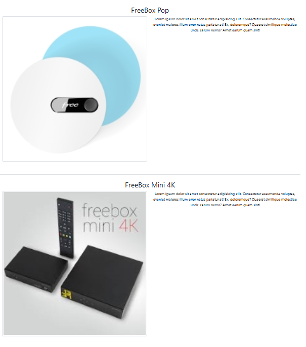

# Défi FreePro

Défi FreePro est un projet de création de page de compte et d'identification utilisant PHP, Bootstrap et MySQL.

## Objectif

Le but principal de ce projet est de permettre aux utilisateurs de créer un compte, de s'identifier.
Differents bonus ont été ajouté a découvrir tout au long de l'utilisation

## Technologies Utilisées

- **PHP**
- **Bootstrap**
- **MySQL**

## Prérequis

- WampServer (ou tout autre serveur local compatible avec PHP et MySQL)

## Installation

1. **Cloner le projet :**

   ```bash
   git clone https://github.com/ton-username/defi-freepro.git


2. **Cloner le project dans le fichier www de Wamp :**

    ```bash
    cp -r defi-freepro /path/to/wamp/www/FreePro

3. **Importer et utiliser la base de données :**

- Démarrez WampServer 
- Ouvrir phpMyAdmin 
- Créer une nouvelle base de données du nom de votre choix 
- Importer le fichier SQL fourni dans cette base de donnée 
- Dans les fichiers login.php, productInfo.php, profile.php, register.php, validateAccount.php changez les attributs des classes Controlleur et View selon vos moyens de connections a la base de donnée  

4. **Démarrage de l'application**

Depuis n'importe quel navigateur rendez vous sur localhost/FreePro

Connectez vous d'abord à un compte déjà existant comme par exemple test@test.com / MDP = Test1234*
De là vous allez pouvoir voir les différents produits réservé en cliquant sur ce bouton 


Le résultat sera en fonction de ce que l'admin a sélectionné pour vous comme nous allons le voir ensuite. Commencez par cliquer sur Logout.

Il est temps de créer un nouveau compte dans la partie Register cette fois ci lors de la connexion c'est un peu different


En cliquant sur ce bouton vous prevenez l'adminisatrateur qu'il faut activer votre compte, Logout et rendez vous sur le compte admin en vous connectant sur test@admin.com mdp = Test1234*. 
En cliquant sur le bouton Check Notifications un menu déroulant apparait selectionnez une notification et vous pouvez maintenant sélectionner les produits réservé par le client.


Et voilà de retour sur votre nouveau compte crée vous allez pouvoir cette fois cliquer sur See my profile et admirez vos produits 



5. **Contributeurs**

Ben moi [Yrles Anthony et mon github](https://github.com/anthony-yrles)